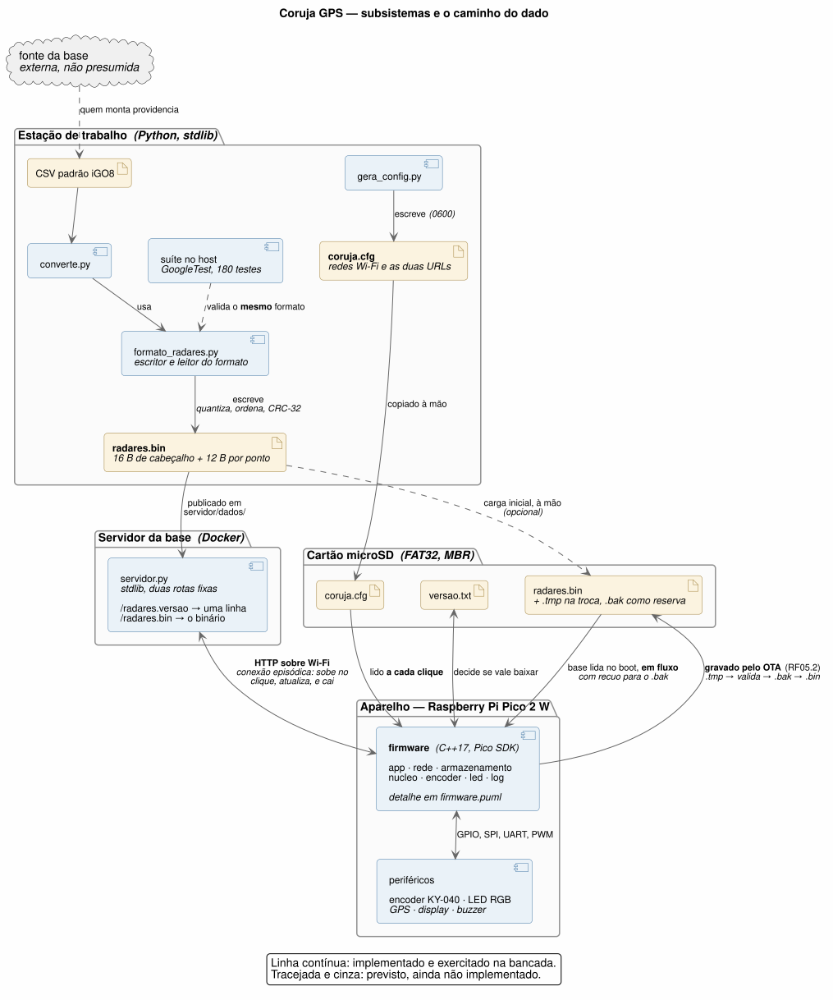
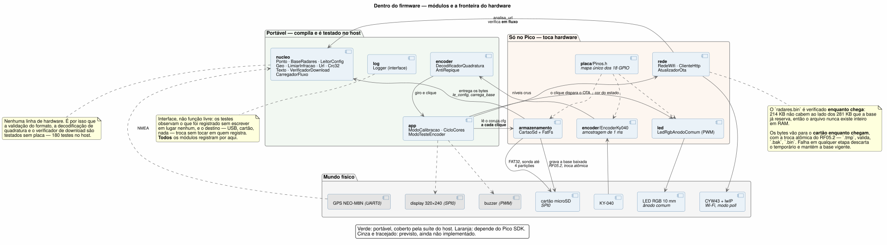

# coruja_gps — detector de radares embarcado

Projeto pessoal de estudo em sistemas embarcados: um alertador de radares e semáforos
sobre **Raspberry Pi Pico 2 W**, com firmware em **C++17 / Pico SDK**.

Lê telemetria de um GPS NEO-M8N por UART, confronta a posição com uma base local de
18.294 pontos e sinaliza em quatro zonas por display, LED RGB periférico e buzzer.

## Arquitetura



Quatro subsistemas, e o dado atravessa todos eles. Um CSV vira `radares.bin` na
estação de trabalho; o binário é publicado por um servidor mínimo; a configuração vai
para o cartão à mão; e o aparelho, ao clique, lê o cartão, busca a base pela rede e
**a grava de volta no cartão**.

Essa última parte é o RF05: *"baixá-la e salvá-la no cartão"*, com a troca atômica do
RF05.2 — baixa para `radares.tmp`, valida, renomeia a atual para `radares.bak` e só
então promove a nova. Queda de energia no meio de uma atualização não pode deixar o
aparelho sem base, porque a tela voltaria ao velocímetro normalmente e nada indicaria
a perda.

A cópia do `radares.bin` para o cartão à mão é só a **carga inicial**, e é opcional:
sem base o aparelho sobe, avisa, e o primeiro clique busca tudo pela rede.

No boot a base é lida **em fluxo** do cartão, decodificando direto no vetor de pontos.
Não é preferência de estilo: o arquivo tem 214 KB e o vetor ocupa 281 KB, e não existe
instante em que os dois caibam nos 181 KiB livres. Se o `radares.bin` não validar, o
firmware cai para o `radares.bak` — e avisa que está operando pela reserva.

**De onde vem o CSV é problema de quem monta** — o projeto não presume fonte nenhuma,
e por isso ela aparece no diagrama como uma nuvem anônima.

O que ainda não existe está tracejado e em cinza: gravar no cartão o que foi baixado,
o GPS, o display e o buzzer.

### Dentro do firmware



A divisão que mais importa é a **fronteira do hardware**. Em verde, o que compila e é
testado no host — validação de formato, decodificação de quadratura, verificação de
download, análise de URL. São 180 testes que rodam sem placa nenhuma, e é o que torna
possível trabalhar neste projeto enquanto um módulo não chegou pelo correio.

Em laranja, o que só existe no Pico. Esses módulos são finos de propósito: o
`ClienteHttp` entrega pedaços a quem chamou em vez de acumular, e quem verifica é o
`nucleo`.

### Como regerar os diagramas

As fontes são versionadas em `docs/*.puml`; os SVG são gerados.

```bash
plantuml -tsvg docs/arquitetura.puml docs/firmware.puml
```

## Base de pontos

O firmware carrega `radares.bin`, um binário compacto de 12 bytes por ponto,
ordenado por latitude. Ele é produzido por `converte.py` a partir de um CSV no
**padrão iGO8**:

```
X,Y,TYPE,SPEED,DirType,Direction
-44.021044,-19.799916,1,30,1,257
```

```bash
python3 converte.py base_igo8.txt radares.bin
```

**Outro formato de entrada?** Escreva seu próprio parser — e não reimplemente o
formato binário. `formato_radares.py` expõe as enumerações e o escritor:

```python
from formato_radares import Ponto, TipoPonto, Sentido, escreve

pontos = [Ponto(lat=-19.799916, lon=-44.021044, limite=30, rumo=257,
                tipo=TipoPonto.RADAR_FIXO, sentido=Sentido.UNIDIRECIONAL)]
escreve(pontos, "radares.bin")
```

O `escreve()` cuida de quantização, flags, **ordenação por latitude** e CRC-32 — as
quatro coisas que um parser erraria em silêncio. A ordenação é a pior: a busca
binária do firmware depende dela e erra *sem avisar* se faltar.

Para testar, `formato_radares.le()` relê com as mesmas validações do firmware: se
aceita, o firmware carrega. Use `converte.py` (padrão iGO8) como modelo.

Obter a base é problema de quem monta: o projeto não presume fonte nenhuma.

---

## Alimentação e instalação no veículo

Alimentado pelo **pós-chave**, derivado na caixa de fusíveis. **O que entra no aparelho
é 12 V** — o conversor CC ficou para dentro.

Essa topologia mudou em 2026-09-21, e o motivo foi o buzzer. Ver `docs/adr/0009`.

```
bateria ─ caixa de fusíveis ─ piggyback ─ fusível 2 A ─ 1,5 mm² trançado (12 V)
                                                               │
                                              ┌────────────────▼──────────────┐
                                              │  conector de entrada, 3 vias  │
                                              └────────────────┬──────────────┘
                                                               │  dentro do gabinete
                                     ┌─────────────────────────┼───────────────┐
                                     │                         │               │
                          ┌──────────▼──────────┐   ┌──────────▼─────────┐     │
                          │ TVS 24 V ┬ 470 µF   │   │ conversor 12 V→5 V │     │
                          │ (bidir.) │ 50 V     │   │ NÃO isolado, ≥40 V │     │
                          └──────────┴──────────┘   └──────────┬─────────┘     │
                                                               │ 5 V           │ 12 V
                                                    ┌──────────▼─────────┐  ┌──▼──────────┐
                                                    │ Schottky → VSYS 39 │  │ buzzer, 2 v.│
                                                    └────────────────────┘  └─────────────┘
```

Consumo: **~145 mA em 12 V** (≈1,6 W) em condução normal, com pico de ~200 mA quando a
tensão cai a 9 V durante a partida. No lado de 5 V são ~162 mA normais e ~310 mA no
pior caso sustentado.

### O buzzer é alimentado em 12 V

O **SFM-20B é especificado para 3–24 V**. Em 5 V ele opera perto do mínimo da faixa; em
12 V, perto do meio — e para um piezo ativo a pressão sonora sobe bastante com a
tensão. O **R-32** registra a audibilidade com janelas abertas a 80 km/h como a
incerteza que sobrou do projeto, e nenhuma mudança de firmware a resolve. Esta resolve,
ou pelo menos ataca a causa certa.

O circuito não muda: o `BC337` tem `Vceo` de 45 V, a corrente é a mesma, e o
acionamento pela base continua em 3,3 V através de 1 kΩ. Não há roda-livre a
acrescentar — o buzzer é piezoelétrico, carga capacitiva.

**O `D2` foi removido em 2026-09-25**, justamente por isso: em antiparalelo com carga
capacitiva ele fica reversamente polarizado nos dois estados e nunca conduz. Fecha o
R-16.

O retorno do buzzer não vai ao GND por fio — vai **pelo transistor**. É chaveamento
pelo lado baixo: `+12 V → buzzer → coletor`, `emissor → GND`. Com o `Q1` cortado o
coletor sobe a ~12 V pelo próprio buzzer, que é por que, lendo a netlist parada, as
duas pernas parecem estar no mesmo potencial.

### 🔴 O 12 V agora está dentro do gabinete

Essa é a contrapartida, e é séria.

Antes, com o conversor do lado de fora, nada acima de 5 V entrava na caixa. Agora
entram 12 V, e eles convivem a centímetros de um trilho cujo máximo absoluto é 5,5 V.
**12 V no nó `VSYS` destrói Pico, GPS, display e cartão juntos.**

Três consequências práticas:

* **O conector de entrada tem 3 vias e o do buzzer tem 2**, e isso voltou a ser medida
  de **segurança**, não de robustez. A revisão anterior deste documento dizia que
  trocá-los "deixou de ser destrutivo" — aquilo valia enquanto só havia 5 V; não vale
  mais.
* **O fio de 12 V não é vermelho.** A convenção antiga mandava vermelho para 5 V *e*
  12 V; duas tensões com a mesma cor a três centímetros uma da outra é convite a erro.
  No `.fzz` o 12 V é **magenta**.
* **O fio do coletor também está em 12 V** sempre que o transistor está cortado, ou
  seja, na maior parte do tempo. Não é só o `+12 V` que precisa de cuidado.

### Proteção da entrada de 12 V

O fusível protege o **fio** contra curto; ele não reage a sobretensão. Daí o **TVS
bidirecional de 24 V** (`P6KE24CA` ou `1.5KE24CA`) e um **eletrolítico de 470 µF /
50 V** em paralelo na entrada. O clamp de 24 V cai numa janela estreita: tem de ficar
acima de 16 V, porque a rede é 13,8 a 14,4 V com o motor ligado, e abaixo de 40 V,
porque é o máximo do conversor. O `24CA` clampa em 33,2 V.

**O que isso não resolve:** um *load dump* real chega a 60–120 V por até 400 ms, o que
contra um clamp de 33 V significa mais de 1 kW sustentado — nenhum TVS axial pequeno
sobrevive. O que ele cobre são os transientes frequentes e de baixa energia, que são os
que matam módulo barato no uso diário. Para o load dump, o projeto se apoia em o
alternador de carro moderno já clampar internamente em ~35 V, e isso é **suposição, não
medição**.

Dois detalhes que estragam tudo se errados: o sufixo **`CA`** significa bidirecional, e
a versão `A` montada ao contrário fica em curto permanente; e o **fusível vai antes** da
proteção no percurso do cabo, porque o modo de falha desejável de um TVS é curto.

### Três decisões que não são óbvias

**Pós-chave em vez de bateria direta com relé.** O pós-chave permanece energizado
durante a partida, então não há reinício na ignição. O relé foi descartado porque a
bobina consome 80–150 mA contra ~180 mA do aparelho inteiro — gastaria quase tanto
quanto liga — e o benefício dele (consumo parasita zero) já vem da chave de ignição.

**Fusível de 2 A, não 10 A.** Fusível protege o fio, não a carga. Com 10 A, uma falta
intermediária de 6 A não abriria o fusível mas aqueceria o condutor. O cabo de 1,5 mm²
suporta ~15 A e está sobredimensionado de propósito — mas o fusível acompanha a carga.

**Conversor não isolado, com entrada ≥ 40 V.** As duas condições importam por motivos
diferentes. A entrada ampla é pelo *load dump*: 60–120 V por dezenas de milissegundos
quando a carga do alternador sai, e módulos comuns de 35 V podem não sobreviver. O
**não isolado** é pelo buzzer: sem continuidade entre o negativo de 12 V e o do
aparelho, a corrente do buzzer não fecha pelo emissor do `Q1` e ele simplesmente não
toca. Um conversor isolado — que parece melhor no anúncio — quebraria o circuito.

E há um mínimo tão importante quanto o máximo: **a entrada tem de aceitar ~9 V**,
porque é onde o trilho cai durante a partida. Módulo com mínimo de 12 V reinicia o
aparelho a cada vez que se dá a chave.

### Ajuste opcional da saída do conversor

O Schottky derruba 0,3–0,45 V, então 5,00 V na saída deixam o `VSYS` em ~4,6 V. Se o
módulo for ajustável, regule para **5,35–5,45 V** e o `VSYS` chega a ~5,0 V. **Nunca
acima de 5,8 V** — o `VSYS` aceita no máximo 5,5 V. Meça antes de conectar.

Com o buzzer em 12 V isso deixou de ser crítico: o que dependia de tensão nominal saiu
do trilho de 5 V.

### Conectores do aparelho

| Conector | Vias | Pino A | Pino B |
| :--- | :---: | :--- | :--- |
| Entrada (único) | **3** (central sem uso) | **+12 V** | GND |

Desde 2026-09-25 o **buzzer é soldado direto**, sem conector: os dois fios saem da
placa e vão ao SFM-27 no painel da caixa. Com isso o aparelho tem **um só conector
externo**, e o risco de trocar um pelo outro — que a contagem de vias apenas
administrava — deixa de existir. O preço é serviço: separar a tampa exige dessoldar.

## Documentos

Leia nesta ordem:

| Documento | O que é |
| :--- | :--- |
| **`requirements.md`** | Requisitos funcionais e não-funcionais, matriz de interação homem-máquina e fluxo de telas. É a especificação. |
| **`bom_schematic.md`** | Lista de materiais e roteamento pino a pino, com as pinagens físicas conferidas nas placas. |
| **`formato_dados.md`** | Formato binário `radares.bin`, estratégia de carga em RAM e busca geográfica em dois estágios. |
| **`revisao_tecnica.md`** | Revisão técnica com rastreabilidade: o que foi achado, decidido e o que segue aberto. |
| **`roteiro_bancada.html`** | Procedimento de medição para imprimir, com quadro de registro das leituras. |

## Estado

**Decidido:** C++17 com Pico SDK · GPS+GLONASS a 4 Hz (piso 3 Hz) · conector JST-XH ·
GPS alimentado em 5 V · Zona de Semáforo silenciosa · buzzer escalonado em 3 faixas ·
LED RGB exclusivo de estado de via.

**Pendente de bancada** — ver `roteiro_bancada.html`:

| Item | Medida |
| :--- | :--- |
| R-05 | Vf dos LEDs verde e azul, e calibração das razões R:G (amarelo) e R:B (rosa) |
| R-13 | Tensão do trilho 3V3 sob carga, com backlight em 100% |
| R-17 | Consumo do buzzer e pinagem do transistor |
| R-14 | Inspeção: regulador de 3 pinos na placa GPS — **sem ele, 5 V destroem o módulo** |

**Escopo futuro:** desenho de telas e interfaces visuais.

## Esquemático no Fritzing

`coruja_gps.fzz` foi **gerado** e depois **ajustado à mão** no Fritzing:

```bash
python3 gera_fritzing.py    # ⚠️ sobrescreve o .fzz e DESCARTA o ajuste manual
```

> ⚠️ **O `.fzz` versionado contém trabalho manual que o gerador não reproduz:**
> roteamento dos fios com pontos de dobra, orientação de 16 peças e 4 notas rotulando
> os módulos representados por headers genéricos. Regerar descarta tudo isso.
>
> O gerador é a fonte da **netlist**; o `.fzz` é a fonte do **layout**. Ao mudar a
> fiação, o caminho é editar `NETS`, regerar num arquivo temporário, comparar as redes
> e então aplicar a mudança à mão no Fritzing — não sobrescrever.
>
> **Sem divergências conhecidas** (2026-09-21). O `.fzz` foi regerado a partir da
> netlist atual e depois roteado à mão, fechando o **R-29**.
>
> O anterior tinha acumulado cinco atrasos, e o pior era silencioso: ele trazia o LED
> como **cátodo comum**, que se liga de forma oposta ao ânodo comum real (R-33). Quem
> montasse por ele teria um LED que não acende, sem pista do motivo. Os outros quatro
> eram os GPIO de vermelho e azul trocados (R-35), resistores de 68 Ω onde as medições
> pediam 470 e 150 (R-05), leitor SD com 8 pinos em vez de 9 (R-40) e o display como
> ST7789 240×240.
>
> A lição que fica: um `.fzz` editado à mão **não avisa quando envelhece**. A defesa
> aqui foi comparar netlists entre o gerado e o versionado — vale repetir isso antes de
> cada montagem, e não confiar na memória de quantas correções entraram desde a última
> vez. O documento de referência para montagem continua sendo o `bom_schematic.md`.

A netlist vive em `NETS`, dentro de `gera_fritzing.py`, transcrita do
`bom_schematic.md`. Mudou a fiação? Edite ali e regenere.

O `fritzing_geo.py` calcula a posição real de cada pino: lê o SVG de breadboard da
peça, resolve o mapeamento `connector → svgId` do `.fzp` e aplica os transforms de
grupo. Sem isso os fios sairiam desenhados fora dos pinos. A escala da cena
(90 unidades por polegada) foi medida empiricamente contra um sketch existente.

**Dependências do gerador:** Fritzing instalado (a biblioteca de peças é lida de
`/Applications/Fritzing.app`) e um sketch com a peça do Pico, de onde ela é
reaproveitada e embutida no `.fzz`.

Quatro módulos não têm peça na biblioteca — NEO-M8N, ST7789, leitor microSD e
KY-040 — e são representados por headers fêmea rotulados, com a contagem correta de
pinos. A peça de microSD que existe na biblioteca tem **zero conectores**, é
inutilizável.

Na vista protoboard há fios reais, coloridos por rede: **preto** = GND,
**vermelho** = 5 V, **azul** = 3V3, e cores distintas por grupo de sinal. Esquemático
e PCB usam conexões diretas, exibidas como ratsnest.

## Datasheets

| Arquivo | O que é |
| :--- | :--- |
| `NEO-M8_datasheet_UBX-15031086-R14.pdf` | Datasheet u-blox do módulo GPS, **revisão R14**. É a revisão citada em todas as análises deste projeto. |
| `NEO-M8_datasheet_UBX-15031086-R11.pdf` | Mesmo documento, **revisão R11** — anterior. Mantida para comparação; em caso de divergência, vale a R14. |
| `adafruit-microsd-spi-sdio.pdf` | Guia do breakout microSD. Fonte da polaridade do `DET` (cartão presente = ALTO, pull-up de 4,7 kΩ na placa) e da confirmação de que há pull-up em todos os pinos SPI. |

Valores extraídos do datasheet do GPS e usados no projeto: limites elétricos
(`VCC` 2,7–3,6 V, `VIN` 0–`VCC`, `IPIN` 10 mA), correntes (`ICCP` 67 mA, tracking
30 mA, `ICC_RF` até 50 mA), faixa térmica (−40 a +85 °C, **operação e
armazenamento**) e teto de taxa de navegação (**5 Hz** em GPS+GLONASS, 10 Hz em
GNSS único).
